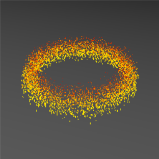

# MIT 6.837 Assignments


Assigments of [MIT 6.837 *Intro to Computer Graphics* (2004 Fall)](https://groups.csail.mit.edu/graphics/classes/6.837/F04/) by KSkun. The image above is one of the rendering results from Assignment 7.

- **Language:** C++

- **Rendering Method:** CPU Ray Tracing / OpenGL

**May exist bugs in previous assignments but fixed in later assignments.**

## Compile & Run

Each assignment project is placed in the folder named `AssignmentX`, with a corresponding `CMakeList.txt`. Please use [CMake](https://cmake.org/) to build, run and test them.

Test case files are stored in the `data` folder in each assignment project. You can test the assignments with these cases from the original course. Result files won't be uploaded, but some are showed as below.

## Features & Results

### Assignment 0: Iterated Function Systems

**Features:**

- Iterated function systems

**Results:**


A fern's image generated by IFS.

### Assignment 1: Ray Casting

**Features:**

- Primitive objects and intersecting with them: prototype class, sphere and group
- Orthographic camera
- Depth image

**Results:**


Balls' image captured by a orthographic camera, along with the depth image.

### Assignment 2: Transformations & Additional Primitives

**Features:**

- Diffuse shading
- Correct shading of the back surface
- Perspective camera
- More primitive objects and intersecting with them: plane and triangle
- Transformations and intersecting with transformed objects
- Normal image

**Results:**


Balls' image captured by a perspective camera, shaded with diffuse shading, along with the normal image.


A squashed ball with transformation.

### Assignment 3: OpenGL & Phong Shading

**Features:**

- Phong shading material
- Gouraud interpolation
- Draw primitive objects with OpenGL

**Results:**


A bunny model consists of transformations and triangles.


Balls with exponent varying materials. Gouraud interpolation enabled.

### Assignment 4: Shadows, Reflection & Refraction

**Features:**

- Ray tracer
- Trace shadow ray, reflected ray and transmitted ray (for transparent material)
- Point light

**Results:**


Traced rays in a transparent bar, including main segment (gray), reflected segment (red), shadow segment (green) and transmitted segment (blue).


A transparent sphere along with a reflective sphere.


3 transparent bars.

### Assignment 5: Voxel Rendering

**Features:**

- Regular grid of the scene
- Insert primitive objects into regular grid
- Ray tracing in regular grid

**Results:**


A traced ray in the grid.


An image of occupied cell in a regular grid, with a bunny model inserted.

### Assignment 6: Grid Acceleration & Solid Textures

**Features:**

- Statistics of key operations
- Grid accelerated ray tracing
- Procedural textures with Perlin noise

**Results:**


100 faces bunny model. Statistics with and without grid acceleration as below.

```
[without acceleration]
********************************************
RAY TRACING STATISTICS
  total time                 0:00:05
  num pixels                 40000 (200x200)
  scene bounds               -0.191055 0.067364 -0.114066  -> 0.121072 0.372852 0.116906
  num grid cells             1 (1x1x1)
  num non-shadow rays        40000
  num shadow rays            66918
  total intersections        21490518
  total cells traversed      0
  rays per second            21383.6
  rays per pixel             2.7
  intersections per ray      201.0
  cells traversed per ray    0.0
********************************************

[with acceleration]
********************************************
RAY TRACING STATISTICS
  total time                 0:00:02
  num pixels                 40000 (200x200)
  scene bounds               -0.191055 0.067364 -0.114066  -> 0.121072 0.372852 0.116906
  num grid cells             700 (10x10x7)
  num non-shadow rays        40000
  num shadow rays            66918
  total intersections        1402630
  total cells traversed      267796
  rays per second            53459.0
  rays per pixel             2.7
  intersections per ray      13.1
  cells traversed per ray    2.5
********************************************
```


A marble like procedural material.

### Assignment 7: Supersampling and Antialiasing

**Features:**

- Supersampling with uniform sampler and jittered sample
- Down-sampling filters including box filter, tent filter and Gaussian filter

**Results:**


Glass ball image rendered with a 16-sample-per-pixel jittered sampler and a Gaussian filter.


Transparent material logo image with a 9-sample-per-pixel jittered sample and a Gaussian filter.

### Assignment 8: Curves & Surfaces

**Features:**

- Draw Bezier spline curves and B-spline curves
- Generate mesh by revolution of a closed curve and Bezier patch
- Convert between 4-point Bezier spline and B-spline curves

**Results:**


A Bezier curve.


A B-spline curve.


A Bezier patch.

### Assignment 9: Particle Systems

**Features:**

- ODE solvers with Euler's method, midpoint method and 4th-order Runge Kutta method
- Particle generators

**Results:**


Generated particles with different position randomness & velocity randomness.


Draw a sine wave with particles. Solvers: Euler's method (red line), midpoint method (green line), RK4 (blue line).



Fire effect made by particles.

